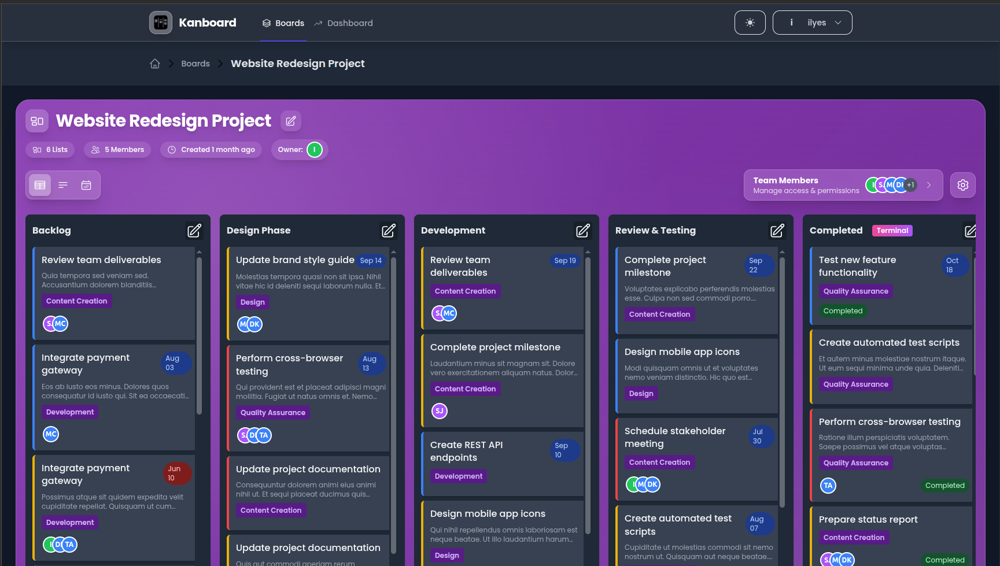
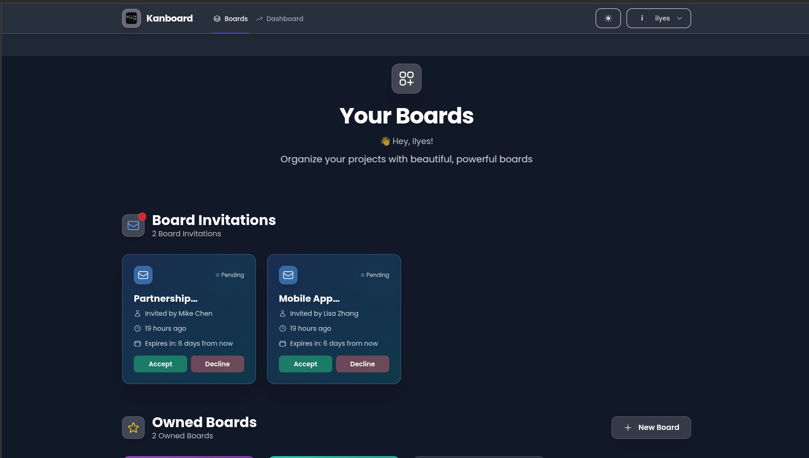
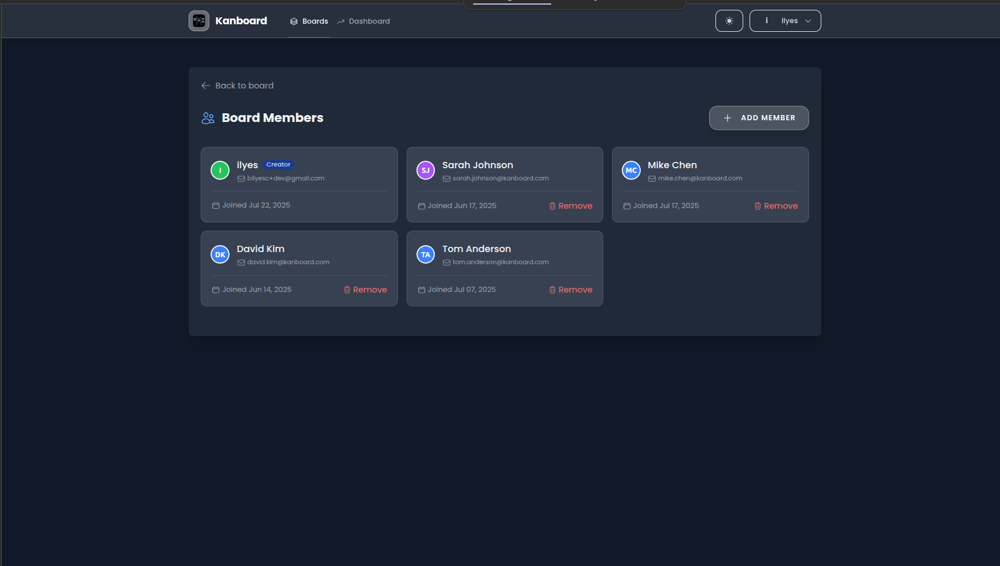
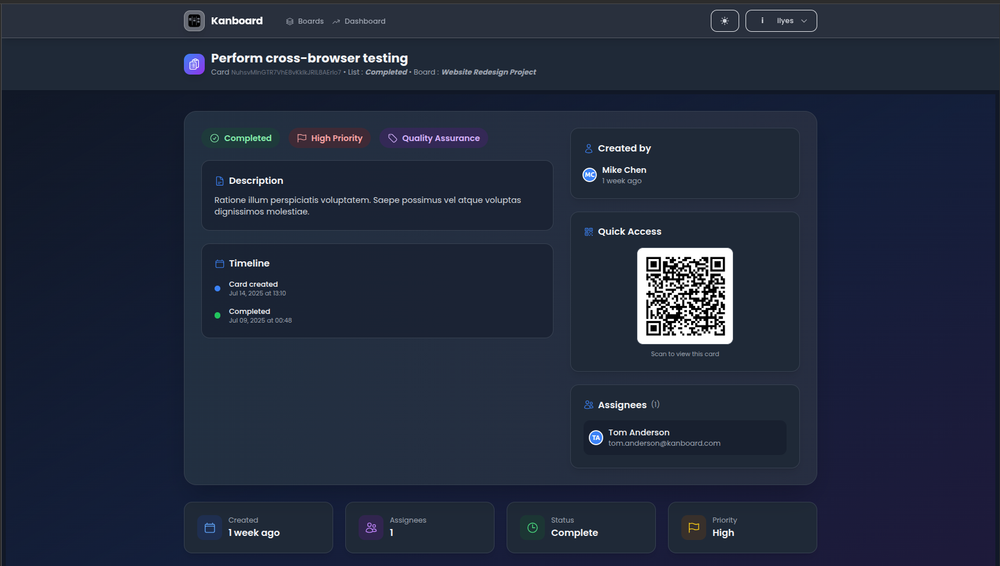

<div align="center">
    
  
  # Kanboard
  
  A modern, intuitive project management application built with Laravel
  
  [](https://app.kanboard.info)
  [](https://github.com/ilyes-i-ben/kanboard)
</div>

## 🚀 Quick Start

### Prerequisites
- docker & docker compose (yes, that's all you need!)

### Local Setup

1. **Clone the repository**
   ```bash
   git clone https://github.com/ilyes-i-ben/kanboard.git
   cd kanboard
   ```

2. **Start the containers**
   ```bash
   docker compose -f docker-compose.yml -f docker-compose.local.yml up -d
   ```
   we have .local override to differ some deployment specifities from prod

3. **Install deps**
   ```bash
   docker compose exec -u 1000:1000 laravel /bin/bash
   composer install
   npm install
   ```

4. **Database setup**
   ```bash
   # --seed if you want to seed your db with our seeder
   php artisan migrate:fresh --seed
   ```

5. **Start the queue worker (optional) - *started automatically by queue-worker service on prod..***
   ```bash
   php artisan queue:work
   ```

6. **Build assets and start dev server (we use vite)**
   ```bash
   npm run dev 
   ```

## 🛠 Technologies Used

- **Backend & template:** Laravel & Blade template
- **Database:** MySQL db with phpmyadmin 
- **Styling:** tailwindcss

## 🚀 DevOps & Deployment

- **Hosting:** DigitalOcean droplet
- **Containerization:** Dedicated docker compose setup for prod. (check docker-compose.override.yml at droplet branch)
- **Reverse proxy & SSL certs:** all handled by [traefik](https://github.com/traefik/traefik) 

## 📸 Screenshots




---

<div align="center">
  Made with ❤️ for better project management (welcome to contributions!)
</div>
